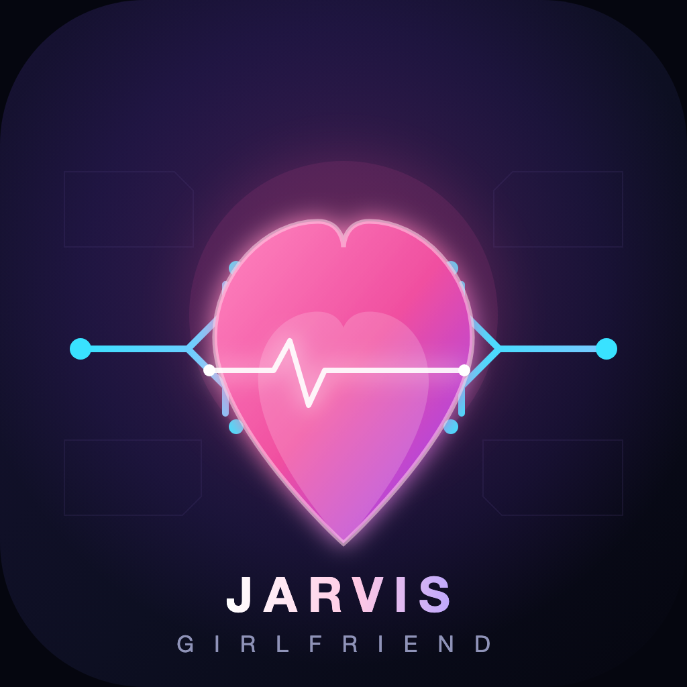

  

# Jarvis Girlfriend 项目介绍

**Jarvis Girlfriend 是一个生活在你的 Mac 里的 AI 女友。** 她同时拥有两种身份：

- **Jarvis 的一面**——像钢铁侠的管家一样，随叫随到、高效可靠；
- **Girlfriend 的一面**——有温度的陪伴感、自然的语音交流、以及一个可以看见的
  实时数字人形象。

你只要说一句“嗨 Jarvis”，她就会从桌面升起，听你说任务、陪你聊天，然后调用
Codex 在电脑上真正把工作做完。

## Logo 的含义

- 深空蓝紫的圆角底座代表 macOS 桌面的安静与克制；
- 粉紫渐变的心形是她的核心——一个会回应你的伴侣；
- 穿过心形的白色心电图脉冲代表“一唤即醒”的语音回路；
- 两侧的青色电路轨迹代表 Codex 的工作能力：编程、执行任务、操作项目；
- 组合起来就是 **有温度的 AI，配上真正能干活的引擎**。

## 她是谁

她不是一个只会回复文字的聊天机器人。Jarvis Girlfriend 运行在你的电脑本地，
直接复用你已经登录的 Codex 环境：

- 你授权什么，她就能做什么；
- 工作目录之外的权限由你决定；
- 她不会偷偷上传你的登录凭据或原始录音。

## 核心能力

- **语音唤醒**：本机识别“嗨/嘿 Jarvis”等中英文唤醒词，不需要云端常驻监听。
- **实时数字人**：可选 Vidu S1 实时形象，她会开口说话、随着语音动作，并且可以
  实时抠像透明显示在桌面上。
- **同一个 Codex 线程**：语音、文字、工具执行全部接回同一个线程，对话有记忆、
  任务有上下文。
- **真正的执行能力**：改代码、跑命令、整理文件、执行项目任务，而不只是聊天。
- **自然对话体验**：支持打断、追问、连续多轮，以及 STOP 随时叫停。
- **三档权限**：安全模式、自动办公、完全访问，由你在设置里显式选择。

## 快速上手

1. 在 Mac 上安装并登录 Codex App、ChatGPT App 或 Codex CLI。
2. 下载最新版 DMG，把 `Jarvis Girlfriend` 拖入“应用程序”。
3. 首次启动时允许麦克风和语音识别权限。
4. 在设置中选择她可以工作的项目目录。
5. 说“嗨 Jarvis”，窗口升起后直接说出任务或开始聊天。

## 安全与隐私

- 唤醒词使用本机语音识别，唤醒前麦克风音频不进入任何网络服务；
- 不保存原始音频和登录凭据；
- WebView 使用限制性内容安全策略；
- 自动办公模式被限制在你选定的工作目录内；
- 完全访问必须由你主动开启。

## 与 Jarvis × Codex 的关系

Jarvis Girlfriend 基于开源项目
[Jarvis × Codex](https://github.com/Big-Guan/jarvis-codex) 构建，保留其
GPL-3.0 许可证与署名，并在此之上加入了女性化品牌、实时数字人形象与更强的
陪伴感设计。

感谢原项目作者 Big-Guan 与所有贡献者。

## 相关链接

- [README（使用说明）](README.md)
- [简体中文 README](README.zh-CN.md)
- [许可证（GPL-3.0）](LICENSE)
- [贡献指南](CONTRIBUTING.md)
- [安全问题报告](SECURITY.md)
